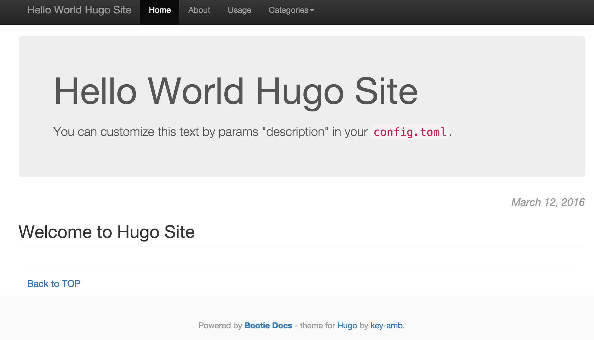

## Create a Hugo website generator on AWS Lambda with Terraform

This project demonstrates how to use [Terraform](https://www.terraform.io/intro/index.html) to manage AWS resources needed to create Hugo static website using AWS Lambda service. 
Resources managed are:

* Source, destination and log buckets on AWS, bucket policies, static websites configuration
* Lambda function, IAM role and policies
* Lambda S3 trigger

This tutorial uses content and ideas from a number of open source projects. See [Acknowledgements](#Acknowledgements) for details.

## Prerequisites

Install the _awscli_, _jq_, _terraform_, and optionally _vagrant_ as described on https://github.com/xuwang/install-tools page.

IAM user assumptions used for this project:

1. Create a group `myhugo` with `AWSLambdaFullAccess`, `IAMFullAccess`, `AmazonS3FullAccess`, and `AmazonRoute53FullAccess` policy.
2. Create a user `myhugo` and __Download__ the user credentials.
3. Add user `myhugo` to group `myhugo`.

## Clone the repo:
```
$ git clone git@github.com:xuwang/aws-hugo
$ cd aws-hugo
```

## Run Vagrant ubuntu box with terraform installed (Optional)
If you use Vagrant, instead of install tools on your host machine,
there is Vagranetfile for a Ubuntu box with all the necessary tools installed:
```
$ vagrant up
$ vagrant ssh
$ cd aws-hugo
```

## Customization

First setup parameters for your site. There is only one file you need to customize.

```
$ cd terraforms
$ cp provider.tf.tmpl provider.tf
```

Edit `terraforms/provider.tf` to set up AWS credentials and other necessary parameters for your hugo site.

Polices for buckets and lambda roles are located under _terraform/artifacts/policies_ directory. The lambda code will be downloaded under _terraform/artifacts_ directory.

## Apply Terraforms 

Run plan first to see what resources will be created.  Still under _terraform_ directory:

```
$ terraform get
$ terraform plan
```
Verify all the resoucre to be created. These are example resouces:

```
module.hugo.aws_iam_policy_attachment.hugo_lambda_attach
module.hugo.aws_iam_role.lambda_role
module.hugo.aws_iam_role_policy.lambda_policy
module.hugo.aws_lambda_function.hugo_lambda
module.hugo.aws_s3_bucket.html
module.hugo.aws_s3_bucket.input
module.hugo.aws_s3_bucket.log
module.hugo.null_resource.lambda_download
module.hugo.template_file.lambda_policy
```

```
$ terraform apply
...
```
You can verify resources created:

```
$ terraform output -module=hugo
aws_route53_record_fqdn = example.com
html_bucket_id = example.com
html_domain = s3-website-us-west-2.amazonaws.com
html_endpoint = example.com.s3-website-us-west-2.amazonaws.com
hugo_lambda_name = hugo-lambda
input_bucket_id = input.example.com
```

## Install S3 event trigger

There are some bugs arouond Terraform lambda resource management. To workaround the issues, let's use
awc cli to create lambda event trigger and s3 bucket invoke policy:

```
$ ./set-s3-trigger.sh
```

## Let's have fun

* Upload Hugo page content to S3 bucket

There is a _hugo-example_ diretory in this repo, which has a simple "Hello World" website:

        $ cd hugo-example

Edit _config.toml_ so the baseurl matches your root_domain:

        baseurl = "http://example.com"

Then upload hugo-example directory to the input bucket we created previously:

        $ cd ..
        $ aws --profile myhugo s3 sync hugo-example/ s3://input.example.com/

* You should be able to go to http://example.com to see the page,like this:


## Clean up

If you no longer need the resources, you can easily wipe out everything you created, including the buckets and contents:

```
$ cd terraform
$ ./delete-s3-trigger.sh
$ terraform destroy
```

## <a name="Acknowledgements">Acknowledgements</a>
* [hugo-aws-lambda-static-website](http://bezdelev.com/post/hugo-aws-lambda-static-website/)
* [Terraform](http://www.terraform.io/downloads.html)
* [Hugo](gohugo.io)

